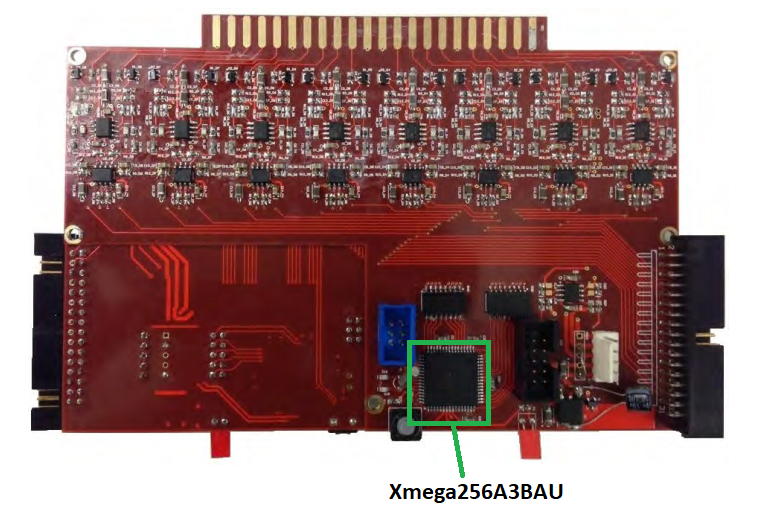

# Project: CSC_FrontEnd

_Author:_ John Leung

_Date:_ 06/20/2014

_Description:_ The FrontEnd Module for CUHK muon telescope. The program is written using Atmel Software Framework (ASF). It is a program that interfaces the _Atmel Xmega256A3BAU Microcontroller_. The detail function of the program can be found in my [thesis](https://bbsonjohn.github.io/assets/MasterThesis.pdf).

  

Image of a front-end module of CUHK muon telescope. Circled in green in the Atmel Xmega256A3BAU Microcontroller, where the source code is located.
